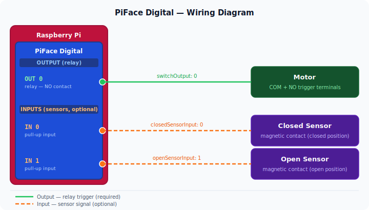

<p align="center">
  <a href="https://github.com/homebridge/homebridge">
    
  </a>
</p>

<h1 align="center">homebridge-garage-piface</h1>

<p align="center">
  <a href="https://www.npmjs.com/package/homebridge-garage-piface"></a>
  <a href="https://www.npmjs.com/package/homebridge-garage-piface"></a>
  <a href="https://github.com/homebridge/homebridge"></a>
  <a href="https://github.com/homebridge/homebridge/wiki/Homebridge-2.0-Migration-Guide"></a>
</p>

Garage door and gate opener platform plugin for [Homebridge](https://github.com/homebridge/homebridge) on Raspberry Pi with a [PiFace Digital](http://www.piface.org.uk/products/piface_digital/) board.

Suitable for any device — garage door, gate motor — that requires a brief relay contact to trigger open/close. Supports open/closed magnetic sensors for real-time state monitoring. Multiple doors/gates can be configured in a single platform entry.

---

## Prerequisites

These steps must be completed **before** installing the plugin.

### 1. Enable SPI

```bash
sudo raspi-config
# Interface Options → SPI → Yes
sudo reboot
```

### 2. Install build tools

```bash
sudo apt-get install -y git build-essential
```

### 3. Compile and install PiFace libraries

```bash
# libmcp23s17
git clone --depth=1 https://github.com/piface/libmcp23s17.git /tmp/libmcp23s17
cd /tmp/libmcp23s17 && make && sudo make install

# libpifacedigital
git clone --depth=1 https://github.com/piface/libpifacedigital.git /tmp/libpifacedigital
cd /tmp/libpifacedigital && make && sudo make install

sudo ldconfig
```

---

## Installation

Install via the Homebridge UI (recommended) or from the terminal:

```bash
sudo hb-service add homebridge-garage-piface
```

> **Note:** If the PiFace libraries were installed **after** the plugin, rebuild the native module:
>
> ```bash
> cd /var/lib/homebridge/node_modules/homebridge-garage-piface
> sudo env PATH="/opt/homebridge/bin:$PATH" /opt/homebridge/bin/npm rebuild node-pifacedigital
> sudo hb-service restart
> ```

---

## Migration from v2.x

Version 3.x converts the plugin from **accessory** to **platform** type. The postinstall script migrates your existing config automatically when you update via the Homebridge UI.

After the update, a **full service restart is required** — either from the Homebridge UI (menu → **Restart Service**) or from the terminal:

```bash
sudo hb-service restart
```

> **Note:** The "Restart Homebridge" button only restarts the bridge process. Use **Restart Service** to also restart Config UI X and clear the plugin type cache.

---

## Configuration

Configure via the Homebridge UI plugin settings, or edit `config.json` directly.

```json
"platforms": [
  {
    "platform": "GaragePiFace",
    "name": "Garage PiFace",
    "accessories": [
      {
        "name": "Garage",
        "switchOutput": 0,
        "switchValue": 1,
        "switchPressTimeInMs": 1000,
        "closedSensorInput": 0,
        "closedSensorValue": 1,
        "openSensorInput": 1,
        "openSensorValue": 1,
        "pollInMs": 4000,
        "opensInSeconds": 15
      },
      {
        "name": "Gate",
        "switchOutput": 1,
        "switchValue": 1,
        "switchPressTimeInMs": 500,
        "opensInSeconds": 20
      }
    ]
  }
]
```

### Parameters

| Parameter | Required | Default | Description |
| --- | --- | --- | --- |
| `name` | yes | — | Display name in HomeKit |
| `switchOutput` | yes | — | PiFace output relay index (0–7) |
| `switchValue` | | `1` | Relay active value: `1` = ACTIVE\_HIGH, `0` = ACTIVE\_LOW |
| `switchPressTimeInMs` | | `1000` | Duration the relay stays active (ms) |
| `closedSensorInput` | | — | PiFace input pin for closed position sensor (0–7) |
| `closedSensorValue` | | `1` | Input value when door is closed |
| `openSensorInput` | | — | PiFace input pin for open position sensor (0–7) |
| `openSensorValue` | | `1` | Input value when door is open |
| `pollInMs` | | `4000` | Sensor polling interval (ms) |
| `opensInSeconds` | | `10` | Time for the door to fully open or close (s) |

If neither sensor input is configured, the plugin relies on last known state.

---

## Hardware wiring



The PiFace Digital board provides 8 open-collector outputs (relays 0–1 are physical relays) and 8 inputs with pull-up resistors.

- Connect the relay output to the door/gate motor trigger terminals.
- Connect magnetic sensors to the input pins. Set `closedSensorValue` / `openSensorValue` to `1` for normally-open contacts, `0` for normally-closed.

---

## Credits

Based on [homebridge-garage-gate-opener](https://github.com/MForge/homebridge-garage-gate-opener) by [MForge.org](https://www.mforge.org/).
